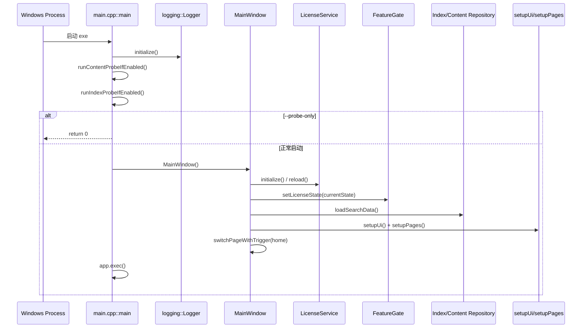
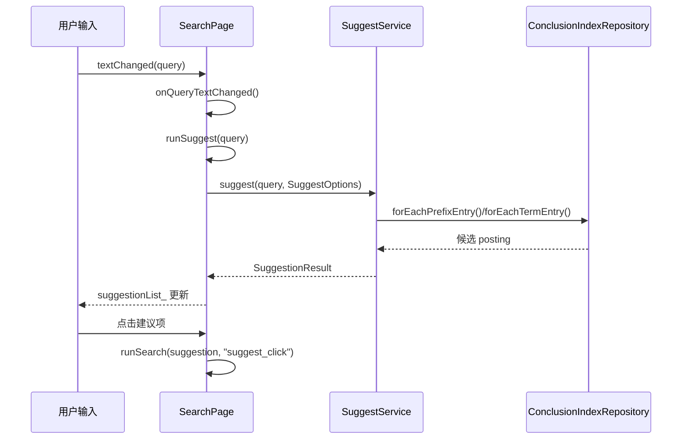
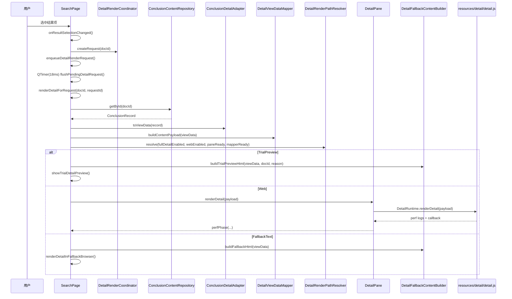
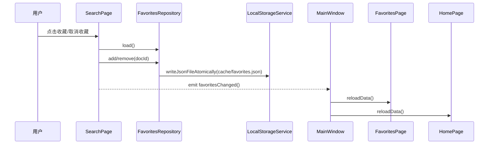
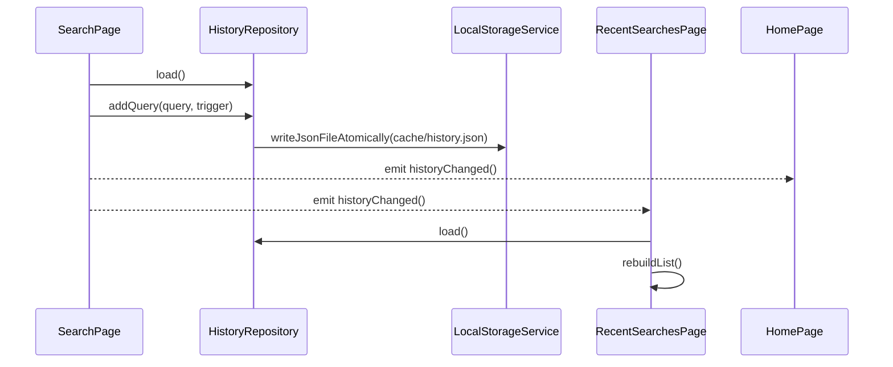
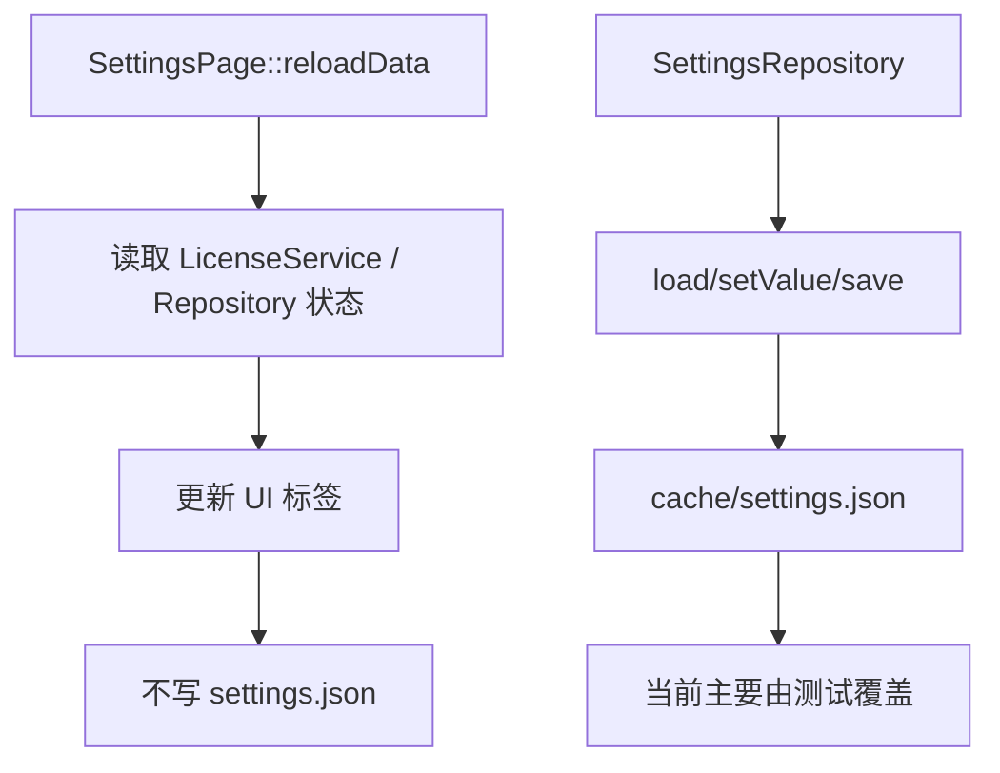
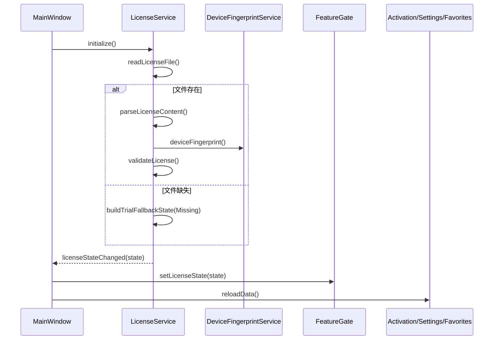
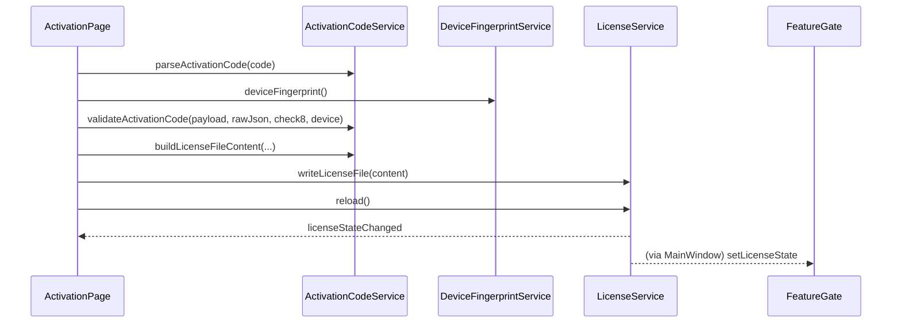

# 运行时流程

## 1. 应用启动流程

实际入口在 `src/main.cpp`，核心初始化顺序如下：
- `main()` 创建 `QApplication`。
- `logging::Logger::initialize()` 初始化日志。
- 可选执行 `runContentProbeIfEnabled()`、`runIndexProbeIfEnabled()`。
- 若带 `--probe-only` 参数，探测后直接退出，不进入 UI。
- 创建 `MainWindow`：在构造函数内先做授权状态初始化，再加载数据，再装配页面。
- `MainWindow::switchPageWithTrigger(kPageHome, "startup_default")` 设置首页。



## 2. 搜索输入到结果显示流程

### 2.1 输入联想（Suggest）

- 输入框 `QLineEdit::textChanged` 绑定到 `SearchPage::onQueryTextChanged()`。
- 非空输入触发 `SearchPage::runSuggest()`。
- `runSuggest()` 组装 `SuggestOptions`（含 module/category/tag 过滤），调用 `SuggestService::suggest()`。
- Suggest 数据来自 `ConclusionIndexRepository` 的 `prefixIndex` + `termIndex`。
- 结果写入 `suggestionList_`；点击建议项触发 `runSearch(..., "suggest_click")`。



### 2.2 搜索执行（结果列表）

- 触发入口：
  - `onSearchButtonClicked()` -> `runSearch(..., "button")`
  - `onQueryReturnPressed()` -> `runSearch(..., "return")`
  - `onSuggestionClicked()` -> `runSearch(..., "suggest_click")`
  - `onFilterChanged()` 在高级筛选可用时触发 `runSearch(..., "filter_change")`
- `runSearch()` 先做门控检查：
  - 必须至少启用 `BasicSearchPreview` 或 `FullSearch`。
- 历史写入策略：仅 `button/return/suggest_click` 触发 `HistoryRepository::addQuery()`。
- 最终通过 `renderResults()` 刷新列表，并默认选中第一条结果（触发详情流程）。

```mermaid
flowchart TD
  A[runSearch(query, trigger)] --> B{indexReady && searchService?}
  B -- 否 --> B1[状态栏报错并结束]
  B -- 是 --> C{FeatureGate: BasicSearchPreview or FullSearch}
  C -- 否 --> C1[显示授权限制并结束]
  C -- 是 --> D{trigger in button/return/suggest_click}
  D -- 是 --> D1[HistoryRepository.load/addQuery + emit historyChanged]
  D -- 否 --> E
  D1 --> E[SearchService.search]
  E --> F[applySort + renderResults]
  F --> G[clearSuggestions]
  G --> H{有结果?}
  H -- 否 --> H1[空态 + 详情占位]
  H -- 是 --> H2[resultList.setCurrentRow(0)]
```

## 3. 点击结果到详情显示流程

- 结果列表 `currentItemChanged` 绑定 `onResultSelectionChanged()`。
- 详情请求先进入 `enqueueDetailRenderRequest()`，通过 `DetailRenderCoordinator` 生成 `requestId`。
- 使用 `detailSelectionCoalesceTimer_`（18ms）合并高频选中切换。
- `renderDetailForRequest()` 从 `ConclusionContentRepository` 取记录，`ConclusionDetailAdapter` 转 `ConclusionDetailViewData`，`DetailViewDataMapper` 生成 payload。
- `DetailRenderPathResolver::resolve()` 统一决定当前请求走 `TrialPreview / Web / FallbackText` 分支。
- 授权分支：
  - 未开 `FullDetail` -> `showTrialDetailPreview()` -> `DetailFallbackContentBuilder::buildTrialPreviewHtml()`（文本预览）
  - 已开 `FullDetail` 且 Web 可用 -> `dispatchPayloadToWeb()` -> `DetailPane::renderDetail()` -> `detail.js`
  - Web 不可用/失败 -> `renderDetailInFallbackBrowser()` -> `DetailFallbackContentBuilder::buildFallbackHtml()`
- 性能链路：`DetailPane::perfPhase` 和 JS `[perf][detail]` 日志都会进入 `SearchPage::logDetailPerf()` -> `DetailPerfAggregator`。



## 4. 收藏 / 历史 / 设置 保存恢复流程

### 4.1 收藏链路

- 操作入口：`SearchPage::onFavoriteButtonClicked()`。
- 仓库：`FavoritesRepository`（底层 `LocalStorageService`）。
- 保存文件：`cache/favorites.json`。
- 页面同步：`SearchPage` 发 `favoritesChanged`，`MainWindow` 刷新 `FavoritesPage` 与 `HomePage`。



### 4.2 历史链路

- 写入触发：`SearchPage::runSearch()` 中满足 `button/return/suggest_click`。
- 仓库：`HistoryRepository`。
- 保存文件：`cache/history.json`。
- 展示恢复：`RecentSearchesPage::reloadData()` 每次页面进入会重载历史。



### 4.3 设置链路（当前状态）

- `SettingsRepository` 和 `AppSettings` 已实现读写默认值、落盘 `cache/settings.json`。
- 但运行时页面 `SettingsPage` 未调用 `SettingsRepository::load/setValue/save`。
- 当前 `SettingsPage::reloadData()` 只展示应用、授权、数据目录与帮助信息。



## 5. 激活 / 授权检查流程

### 5.1 启动时授权恢复

- `MainWindow` 构造期调用 `licenseService_.initialize()`。
- `LicenseService::reload()` 读取 `license/license.dat` 并执行 `parseLicenseContent()` + `validateLicense()`。
- 结果进入 `LicenseState`，通过 `licenseStateChanged` 广播。
- `MainWindow` 收到后更新 `FeatureGate`，并触发 `ActivationPage/SettingsPage/FavoritesPage` 刷新。



### 5.2 激活操作

- 入口：`ActivationPage::onActivateClicked()`。
- 流程：解析激活码 -> 校验设备/过期/功能 -> 生成 license 内容 -> 写 `license.dat` -> `LicenseService::reload()`。
- 当前安全状态：签名验证、payload 解密在代码中是 TODO stub（返回 true）。



---

## 6. Release Hardening Runtime Additions (2026-04-21)

### 6.1 Startup Runtime Layout Check

New startup behavior:

- `main.cpp` calls `AppPaths::inspectRuntimeLayout(true)`
- logs explicit errors/warnings for:
  - missing `data`
  - missing `resources`
  - missing `resources/detail` or `resources/katex`
  - missing `license`
  - cache directory readiness

### 6.2 WebEngine Storage Routing

`main.cpp` configures:

- `QWebEngineProfile::defaultProfile()->setCachePath(cache/webengine)`
- `QWebEngineProfile::defaultProfile()->setPersistentStoragePath(cache/webengine)`

This keeps runtime write data under the `cache` contract.

### 6.3 Detail Failure Visibility

`DetailPane` now escalates:

- shell load failure
- JS runtime init failure
- JS render callback failure

to `SearchPage::activateTextFallbackMode(...)`, which updates page status and switches to text fallback mode with user-visible error text.

### 6.4 MainWindow Bottom Status Composition

`MainWindow` now merges:

- data/index load status
- runtime directory check summary

into `BottomStatusBar::setDataStatusText(...)`, and marks version line as runtime abnormal when needed.
