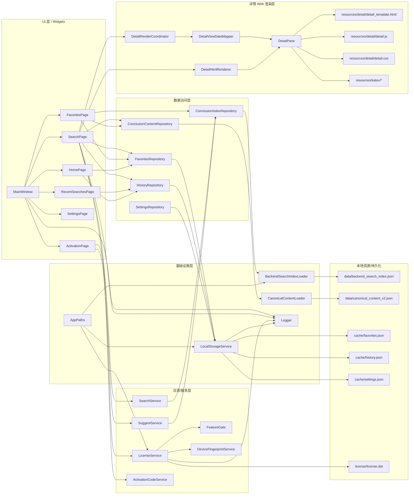
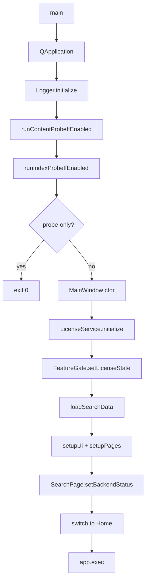

# 系统架构文档

## 1. 项目定位与当前实现范围

### 1.1 项目目标
- 项目定位：Windows 本地离线版桌面应用，目标是“高中数学二级结论快速搜索与详情查看”（Qt 6 Widgets + 本地数据 + 本地渲染）。
- 当前代码的主工作模式：离线运行、离线数据加载、离线 license 文件校验。

### 1.2 当前版本能力分级（基于真实代码）

#### 已实现
- 应用启动、主窗口装配、页面切换与跨页信号联动。
- 搜索链路：关键词搜索、基础筛选、排序、结果展示。
- Suggest 链路：输入联想建议、点击建议触发搜索。
- 详情链路：结果选中 -> 详情数据映射 -> WebEngine 渲染；并提供文本回退模式。
- 收藏链路：搜索页收藏/取消收藏、收藏页展示、收藏页回跳搜索页打开详情。
- 历史链路：搜索触发写入历史、历史页重搜/删除/清空。
- 授权状态驱动功能门控（FeatureGate），可实时影响搜索/详情/收藏/筛选能力。
- 本地持久化底座：`cache/favorites.json`、`cache/history.json`、`cache/settings.json` 原子写盘。

#### 部分实现
- 设置持久化：`SettingsRepository` 实现完整且有测试，但运行时页面未接线到真实设置读写流程。
- 激活/授权安全校验链路：激活闭环可用，但关键安全校验（签名/加密等）仍是 TODO stub。

#### 仅骨架 / 预留
- 收藏页筛选按钮（文案“筛选（即将支持）”）当前无实际逻辑。
- 激活页“查看升级方案”仅弹窗提示“暂未接入在线升级流程”。
- 设置页“扩展预留”区块是说明性预留。
- `src/app`、`resources/web` 目录当前为空占位。

#### 规划中（代码中有明确文案或 TODO）
- License/Activation 真实签名体系接入（`Ed25519/ECDSA`）与 payload 加密协议。
- 更严格的到期策略（UTC/时区/宽限期/时间源）。
- Feature 套餐完整性校验。
- 在线升级流程接入。

---

## 2. 目录结构总览

### 2.1 根目录关键目录
- `src/`：主代码。
- `data/`：运行时搜索索引与内容数据。
- `resources/`：详情模板、KaTeX 资源、静态资源。
- `cache/`：收藏/历史/设置本地持久化。
- `license/`：`license.dat` 文件目录。
- `tests/`：单元测试与页面 wiring 测试。
- `docs/`：文档与阶段总结。
- `out/`：构建产物目录（由 CMake Preset 指向）。

### 2.2 `src` 内部边界
- `src/ui/`：主窗口、页面、Widget、详情渲染桥接。
- `src/domain/`：模型、适配器、服务、业务仓库。
- `src/infrastructure/`：数据加载（JSON）与本地存储服务。
- `src/license/`：设备指纹、激活码、license 状态与功能门控。
- `src/core/logging/`：统一日志系统。
- `src/shared/`：路径与 UI 常量。

---

## 3. 总体架构图

---

## 4. 启动与初始化流程

### 4.1 从 `main` 到主窗口
- 入口：`src/main.cpp` `main(int argc, char* argv[])`。
- 初始化顺序（真实代码）：
  1. 创建 `QApplication`。
  2. 设置组织名/应用名。
  3. `logging::Logger::instance().initialize()`。
  4. 可选 probe：`runContentProbeIfEnabled()`、`runIndexProbeIfEnabled()`。
  5. 如果 `--probe-only`，直接退出，不进入 UI。
  6. 创建并显示 `MainWindow`。

### 4.2 `MainWindow` 构造期装配
- `MainWindow` 成员先构造：
  - `ConclusionIndexRepository`
  - `ConclusionContentRepository`
  - `SearchService`（绑定 index repo）
  - `SuggestService`（绑定 index repo）
  - `LicenseService`（绑定 `DeviceFingerprintService`，测试可注入固定指纹）
  - `FeatureGate`
- 构造函数中关键步骤：
  1. `licenseService_.initialize()`。
  2. `featureGate_.setLicenseState(licenseService_.currentState())`。
  3. `loadSearchData()`：加载 index + content。
  4. `setupUi()` + `setupPages()` 装配页面。
  5. `searchPage_->setBackendStatus(indexLoaded_, contentLoaded_)`。
  6. 首次切页 `switchPageWithTrigger(kPageHome, "startup_default")`。

### 4.3 启动流程图

---

## 5. 页面与交互架构

### 5.1 页面清单（`QStackedWidget`）
- `HomePage`（首页入口与预览）
- `SearchPage`（核心搜索 + 详情）
- `FavoritesPage`（收藏管理）
- `RecentSearchesPage`（历史管理）
- `SettingsPage`（状态展示与帮助）
- `ActivationPage`（激活与升级入口）

### 5.2 页面切换与刷新策略
- 统一入口：`MainWindow::switchPageWithTrigger()`。
- 切页后按页触发 `reloadData()/refresh`：
  - Recent/Favorites/Home/Settings/Activation 页面切入时刷新。
  - Search 页面切入时刷新收藏按钮状态。

### 5.3 跨页信号接线（已实现）
- `RecentSearchesPage::searchRequested` -> `SearchPage::triggerSearchFromRecent`。
- `FavoritesPage::openConclusionRequested` -> `SearchPage::openConclusionById`。
- `SearchPage::favoritesChanged/historyChanged` -> 触发 Favorites/Home/Recent 联动刷新。
- `HomePage` 的导航/预览信号 -> 页面切换或直接触发搜索/打开详情。

### 5.4 页面实现状态
- `SearchPage`：已接入真实搜索、建议、详情、收藏、历史、授权门控。
- `FavoritesPage`：已接线到真实收藏数据；筛选按钮未实现。
- `RecentSearchesPage`：已接线到真实历史数据。
- `SettingsPage`：主要是只读状态展示，不是“真实设置编辑页”。
- `ActivationPage`：激活码离线流程已通；在线升级入口未接入。
- `HomePage`：入口与预览已接线，但定位偏导航聚合而非业务处理。

---

## 6. 核心业务链路

### 6.1 搜索链路

- 入口：
  - `SearchPage::onSearchButtonClicked()`
  - `SearchPage::onQueryReturnPressed()`
- 关键调用：
  - `SearchPage::runSearch(query, triggerSource)`
  - `SearchService::search(query, SearchOptions)`
  - `ConclusionIndexRepository::findTerm/findPrefix/getDocById`
  - `SearchPage::renderResults()`
- 数据来源：`data/backend_search_index.json`。
- 输出：左侧结果列表，默认选中首条进入详情。
- 当前状态：已实现。
- 机制细节：
  - 支持 term + prefix。
  - 支持 module/category/tag 过滤（受 `AdvancedFilter` 功能门控）。
  - 结果排序支持相关度/标题/难度（在 UI 层再次排序）。
  - 体验版结果数量裁剪（`kTrialPreviewLimit`）。
- 风险/待确认：
  - 搜索逻辑直接依赖 index repo，无中间应用层编排，UI 与算法耦合较紧。

### 6.2 Suggest 链路

- 入口：`SearchPage::onQueryTextChanged()`。
- 关键调用：
  - `SearchPage::runSuggest()`
  - `SuggestService::suggest(query, SuggestOptions)`
  - `ConclusionIndexRepository::forEachPrefixEntry/forEachTermEntry`
- 数据来源：index 中 `prefixIndex/termIndex`。
- 输出：建议列表；点击项 `onSuggestionClicked()` 后 `runSearch(..., "suggest_click")`。
- 当前状态：已实现。
- 风险/待确认：
  - `ConclusionIndexRepository::optionalSuggestions()` 当前未接入 SuggestService 主流程。

### 6.3 详情渲染链路

- 入口：`SearchPage::onResultSelectionChanged()`。
- 关键调用路径：
  - `enqueueDetailRenderRequest()`
  - `DetailRenderCoordinator::createRequest/isRequestStale`
  - `renderDetailForRequest()`
  - `ConclusionContentRepository::getById()`
  - `ConclusionDetailAdapter::toViewData()`
  - `DetailViewDataMapper::buildContentPayload()`
  - `dispatchPayloadToWeb()` -> `DetailPane::renderDetail()`
  - `DetailHtmlRenderer::buildRenderScript()` -> `window.DetailRuntime.renderDetail(...)`
- Web 资源装配：
  - `resources/detail/detail_template.html`
  - `resources/detail/detail.js`
  - `resources/detail/detail.css`
  - `resources/katex/*`
- 回退机制：
  - Web 模式不可用或失败 -> `activateTextFallbackMode()` + `renderDetailInFallbackBrowser()`。
- 性能链路：
  - C++ 侧 `DetailPerfAggregator`
  - JS 侧 `[perf][detail]` console log 回传 `DetailPane::handleJsConsoleMessage()`
- 当前状态：已实现。
- 风险/待确认：
  - Web/文本双渲染路径并存，维护复杂度高。

### 6.4 收藏链路

- 入口：`SearchPage::onFavoriteButtonClicked()`。
- 核心调用：
  - `FavoritesRepository::load/contains/add/remove`
  - `LocalStorageService::writeJsonFileAtomically(favorites.json)`
  - `emit favoritesChanged()` -> MainWindow 联动刷新。
- 收藏页：`FavoritesPage::reloadData()` 从 repo 读取并渲染 `FavoriteItemCard`。
- 当前状态：已实现（收藏增删查、回看详情）。
- 部分实现：
  - `FavoritesPage` 过滤按钮无业务逻辑（空 lambda）。
- 待确认：
  - 收藏时间排序依赖 `favorites.json` 的 `items[].favoritedAt/...`，但 `FavoritesRepository` 默认只写 `ids`。

### 6.5 历史记录链路

- 写入入口：`SearchPage::runSearch()`，仅 `button/return/suggest_click` 触发写历史。
- 核心调用：
  - `HistoryRepository::load/addQuery/save`
  - `LocalStorageService` 写 `cache/history.json`
- 展示入口：`RecentSearchesPage::reloadData()`。
- 交互：重搜、删除、清空都会回写并发 `historyChanged`。
- 当前状态：已实现。

### 6.6 设置持久化链路

- 现状：
  - `SettingsRepository` + `AppSettings` 有完整读写与默认值体系。
  - 但 `SettingsPage` 主要是状态展示（license/data/help/feedback），未见对 `SettingsRepository` 的运行时调用。
- 当前状态：部分实现。
- 风险：
  - 维护者容易误以为“设置页已可持久化编辑”，实际未接线。

### 6.7 激活/授权链路

- 激活页入口：`ActivationPage::onActivateClicked()`。
- 核心路径：
  - `ActivationCodeService::parseActivationCode()`
  - `ActivationCodeService::validateActivationCode()`
  - `ActivationCodeService::buildLicenseFileContent()`
  - `LicenseService::writeLicenseFile()`
  - `LicenseService::reload()` -> `licenseStateChanged`
  - `FeatureGate::setLicenseState()`
- 授权校验：`LicenseService::validateLicense()`（格式、产品、设备、过期、features）。
- 当前状态：部分实现（业务闭环可用，安全校验不完整）。
- 明确 TODO：
  - `ActivationCodeService::verifyActivationSignature()`
  - `ActivationCodeService::decryptActivationPayload()`
  - `LicenseService::verifyLicenseSignature()`
- 预留：`ActivationPage::onViewUpgradePlanClicked()` 在线升级仅提示。

---

## 7. 核心模块职责拆解

### 7.1 Repository
- `ConclusionIndexRepository`：索引查询接口（term/prefix/doc）。
- `ConclusionContentRepository`：内容记录按 ID 读取与枚举。
- `FavoritesRepository`：收藏 ID 集合持久化。
- `HistoryRepository`：搜索历史去重、限长、持久化。
- `SettingsRepository`：设置项键值持久化（运行时未接线）。

### 7.2 Service
- `SearchService`：搜索打分、过滤、结果裁剪。
- `SuggestService`：建议候选采样、评分、去重。
- `LicenseService`：license 读取/解析/校验/状态机。
- `ActivationCodeService`：激活码解析校验 + license 内容构造。
- `FeatureGate`：功能开关映射（trial/full）。
- `DeviceFingerprintService`：生成设备指纹；支持构造注入固定指纹（自动化测试用途）。

### 7.3 Page / View
- `MainWindow`：系统装配与页面编排中心。
- `SearchPage`：核心工作台（搜索 + 详情 + 收藏 + 历史写入）。
- `FavoritesPage`：收藏列表与反向打开详情。
- `RecentSearchesPage`：历史管理。
- `SettingsPage`：只读状态页。
- `ActivationPage`：激活操作页。

### 7.4 Model / DTO / Struct
- `domain/models/search_result_models.h`：`SearchOptions/SearchHit/SearchResult/Suggest*`。
- `domain/models/search_index_models.h`：索引文档/倒排/field mask 模型。
- `domain/models/conclusion_record.h`：内容主模型。
- `domain/models/app_settings.h`：设置默认值模型。
- `license/license_state.h`：授权状态模型。

### 7.5 Infrastructure / Utility
- `BackendSearchIndexLoader`、`CanonicalContentLoader`：JSON 解析与诊断。
- `LocalStorageService`：缓存目录管理 + JSON 读写原子提交。
- `AppPaths`：运行路径解析。
- `Logger` + `LogCategory`：统一日志与分类。

---

## 8. 数据与资源组织

### 8.1 数据文件
- 索引：`data/backend_search_index.json`。
- 内容：`data/canonical_content_v2.json`。
- 收藏：`cache/favorites.json`。
- 历史：`cache/history.json`。
- 设置：`cache/settings.json`。
- 授权：`license/license.dat`。

### 8.2 详情渲染资源
- HTML：`resources/detail/detail_template.html`
- JS：`resources/detail/detail.js`
- CSS：`resources/detail/detail.css`
- KaTeX：`resources/katex/*`

### 8.3 内容与索引边界
- 索引仓库负责“可检索字段与倒排命中”。
- 内容仓库负责“详情展示结构化内容”。
- 搜索结果列表主要来自索引；详情正文来自内容。

### 8.4 运行时资源查找
- 通过 `AppPaths::appRoot()/dataDir()/cacheDir()/licenseDir()` 解析。
- `DetailHtmlRenderer` 在 `resources/detail` 与 `resources/katex` 做存在性校验。

---

## 9. 构建、运行与调试

### 9.1 构建与运行
- CMake Preset：`msvc-debug`、`msvc-release`（`CMakePresets.json`）。
- 典型命令：
  - `cmake --preset msvc-debug`
  - `cmake --build --preset msvc-debug`
  - `powershell .\run-debug.ps1`
- Release 同理（`run-release.ps1`）。

### 9.2 关键依赖
- Qt6 Widgets
- Qt6 WebEngineWidgets
- 本地 `resources/` 与 `data/` 目录

### 9.3 常见失败原因
- `data/*.json` 缺失或格式异常。
- `resources/detail` 或 `resources/katex` 缺失导致 Web 详情退化。
- WebEngine 环境问题导致详情回退文本模式。
- `license/license.dat` 非法导致降级 trial。

### 9.4 日志入口
- `src/core/logging/logger.h/.cpp`
- 环境变量：`MATH_SEARCH_LOG_LEVEL`、`MATH_SEARCH_LOG_DIR`、`MATH_SEARCH_LOG_TO_FILE` 等。
- 重点分类：`search.engine`、`detail.render`、`webview.katex`、`file.io`、`config`。

### 9.5 推荐断点入口
- 启动：`main()`、`MainWindow::MainWindow()`、`MainWindow::loadSearchData()`。
- 搜索：`SearchPage::runSearch()`、`SearchService::search()`。
- Suggest：`SearchPage::runSuggest()`、`SuggestService::suggest()`。
- 详情：`SearchPage::renderDetailForRequest()`、`DetailPane::dispatchNow()`。
- 持久化：`LocalStorageService::writeJsonFileAtomically()`。
- 授权：`ActivationPage::onActivateClicked()`、`LicenseService::reload()`。

### 9.6 功能验证建议
- 搜索：输入关键词，确认 result list 与 status 行更新。
- 详情：点击结果，确认 Web 或 fallback 内容可见。
- 收藏：添加/取消后检查 `cache/favorites.json` 与页面联动刷新。
- 历史：执行搜索后检查 `cache/history.json` 与 Recent 页面。
- 激活：输入合法激活码后检查 `license/license.dat` 与功能门控变化。

---

## 10. 技术债、风险与后续建议

### 10.1 已识别技术债
- `SearchPage` 职责过重（搜索、suggest、详情渲染、缓存、性能埋点、收藏、历史写入、功能门控都在同类）。
- 收藏时间 schema 不统一：仓库写 `ids`，页面又读 `items` 时间字段。
- 设置持久化链路未接线，容易造成“有仓库无业务”。
- 授权安全关键校验是 TODO stub。
- Web 详情模板与 C++ payload 字段强耦合，缺少契约层校验。

### 10.2 建议治理顺序
1. 先补齐授权签名/解密真实校验。
2. 统一收藏文件 schema（明确是否需要 `items` + 时间）。
3. 将 `SearchPage` 拆分为查询编排、详情编排、状态管理子组件。
4. 明确 Settings 页定位：要么做真实可编辑设置，要么改名为“状态/关于”。
5. 为 detail payload 建立字段契约测试（C++ mapper 与 JS runtime 同步校验）。

---

## 11. 维护者阅读顺序建议

### 第一小时
1. `src/main.cpp`
2. `src/ui/main_window.h/.cpp`
3. `src/ui/pages/search_page.h/.cpp`

### 第一天
1. `src/domain/services/search_service.cpp`
2. `src/domain/services/suggest_service.cpp`
3. `src/infrastructure/data/*loader*.cpp`
4. `src/ui/detail/*`
5. `src/license/*`

### 按改动目标快速定位
- 改搜索逻辑：`SearchPage::runSearch` + `SearchService::search` + `ConclusionIndexRepository`。
- 改详情渲染：`SearchPage::renderDetailForRequest` + `ui/detail/*` + `resources/detail/*`。
- 改本地存储：`LocalStorageService` + `FavoritesRepository/HistoryRepository/SettingsRepository`。
- 改授权：`ActivationPage` + `ActivationCodeService` + `LicenseService` + `FeatureGate`。
